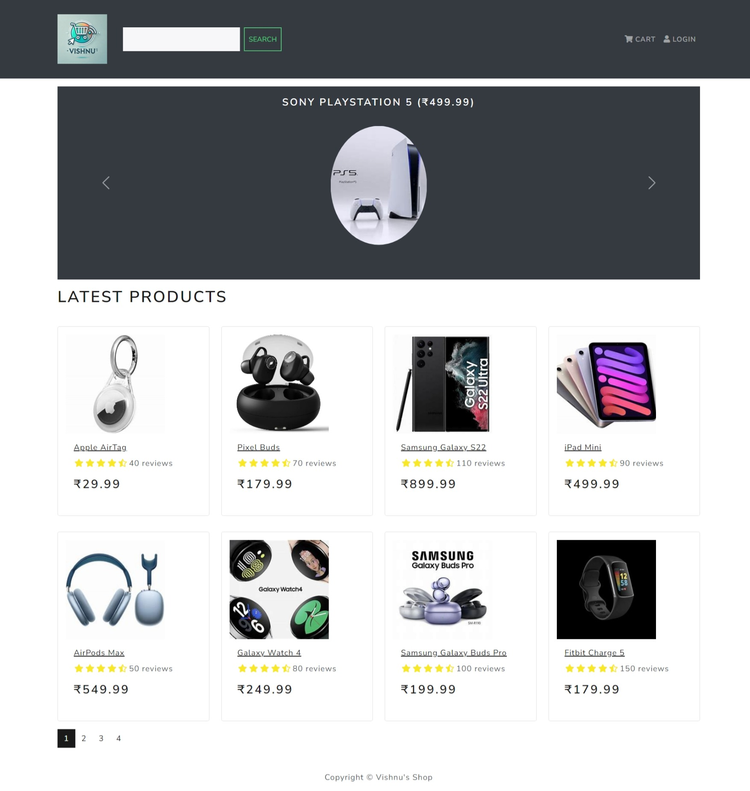
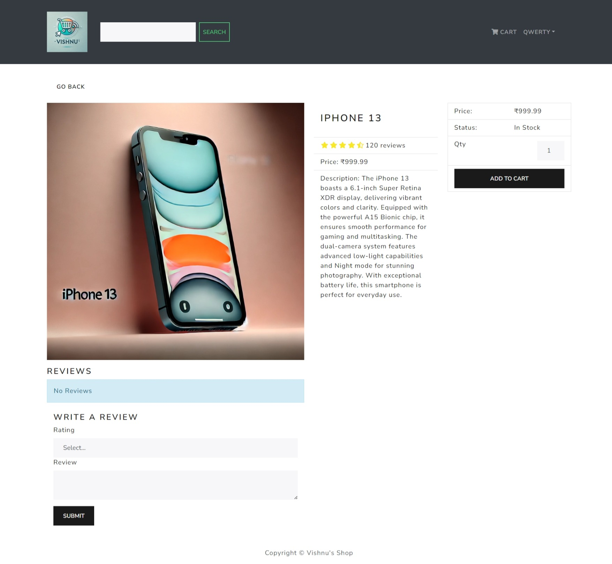
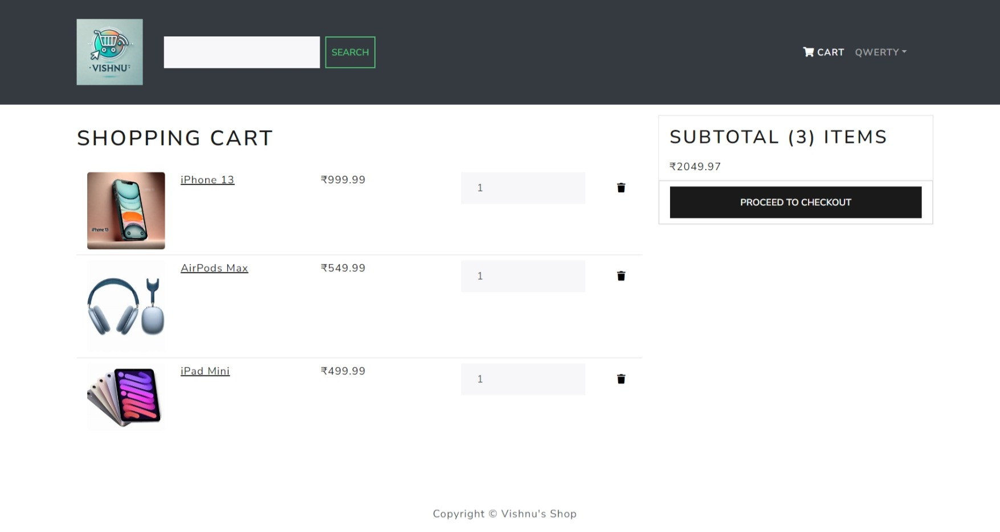
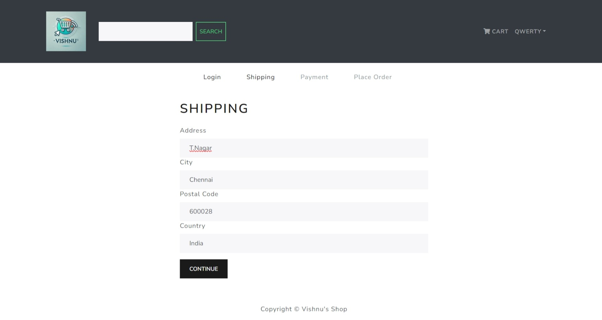
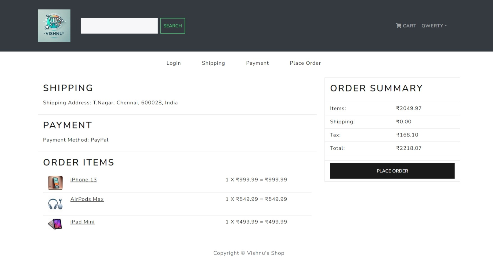
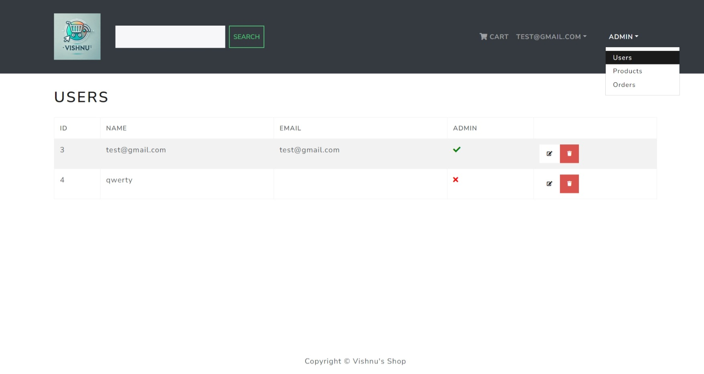
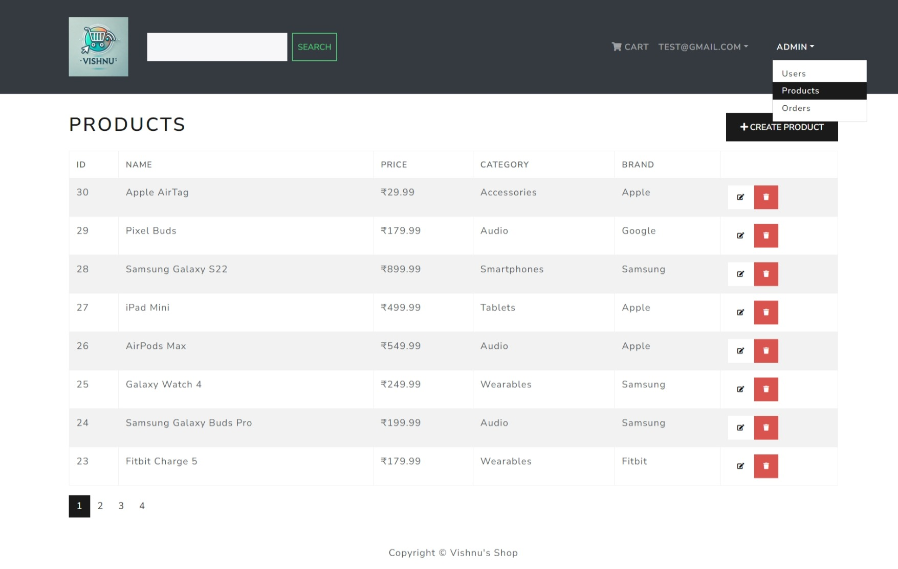

# E-Commerce Web Application

An E-Commerce web application built with Django for the backend and React for the frontend, providing a full-stack shopping platform with features like product management, user authentication, cart functionality, and more.

## Features

- **Product Listings**: Display a wide range of products with details such as name, brand, category, description, price, rating, and stock status.
- **Product Details**: View detailed information about individual products.
- **Shopping Cart**: Add items to the cart and manage quantities before checkout.
- **User Authentication**: Secure user registration, login, and logout functionality.
- **Checkout Process**: Seamless checkout process with shipping details, order summary, and payment options.
- **Admin Panel**: Manage products, orders, and user data.
- **Responsive Design**: Optimized for both desktop and mobile devices.

## Technologies Used

### Backend
- **Django**: Web framework for Python used to build the backend APIs and manage the database.
- **Django REST Framework**: Provides APIs for frontend to interact with the backend.
- **SQLite**: Default database for development purposes, easily switchable to other DBMS like PostgreSQL or MySQL.

### Frontend
- **React**: JavaScript library for building the user interface.
- **React Router v6**: For routing between different pages in the app.
- **Redux**: For state management across the app (optional if used).
- **Axios**: For making HTTP requests from the frontend to the backend.

## Installation and Setup

- Clone the repository:
  ```bash
  git clone https://github.com/Vishnu-Kumar127/E-Commerce.git
  cd E-Commerce

- Install backend dependencies:
  ```bash
  cd backend
  pip install -r requirements.txt

- Set up the database:
  ```bash
  python manage.py migrate

- Create a superuser for the admin panel:
  ```bash
  python manage.py createsuperuser

- Install frontend dependencies:
  ```bash
  cd ../frontend
  npm install 
- Start the development server for the backend:
  ```bash
  python manage.py runserver

- Start the development server for the frontend:
  ```bash
  npm start

- Open the app in your browser at `http://localhost:3000`.


## Sample Workflow

### 1. Homepage with Product Listings:
   - Browse products with images, price, brand, and ratings.
   
   

### 2. Product Details Page:
   - View detailed product descriptions, available stock, and user reviews.
   
   

### 3. Shopping Cart:
   - Add or remove items from the shopping cart and view the total price.

   

### 4. Checkout:
   - Complete the checkout process by providing shipping details and payment.

   
   

### 5. Admin Dashboard:
   - Manage products, orders, and user accounts through the admin panel.

   
   


## Future Enhancements

- **Payment Integration**: Add payment gateways like Stripe or PayPal.
- **Product Search and Filters**: Allow users to search and filter products.
- **Order History**: Enable users to view past orders.
- **Reviews and Ratings**: Let users add reviews and ratings for products.
